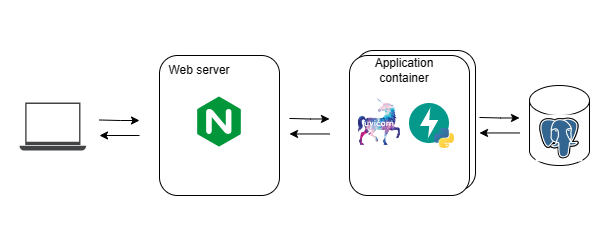

# Resola assignment - Book app

## Features 

### User managemnt

| endpoint    | description                                                                                              |
|-------------|----------------------------------------------------------------------------------------------------------|
| `/register` | Allow user to register with email and password. No validation on email pattern and password              |
| `/token`    | Registered user login with email and password and get the `access_token` for required authenticated APIs |

### Book management

1. List books - `GET /books`

    List all books available in the system. Available arguments:

        * page: Current page of the list, default 1
        * limit: Number of records 
        * pulish_date: Filter books on specific publish_date (ex: 2023-01-01)
        * author: Filter books by author

2. View book - `GET /books/{book_id}`

    View detail of given book_id

3. Create book - `POST /books`

    This feature is only available for login users. Each book is unique by title and author; the user cannot create new books if there is an existing book with the same title and author.

4. Update book - `PUT /books/{book_id}`

    This feature is only available for login users. The user can update title, author, isbn, pulish_date and price of the given book_id

5. Delete book - `DELETE /books/{book_id}`

    This feature is only available for login users. The user delete record of the given book_id

## Architecture



## Setup

Prerequisite:

* python >= 3.9
* postgres = 16


1: Setup database. Prepare your database and credential then use the file `init.sql` to create table schemas

2: Setup application dependencies

`python -m pip install -e .`

3: Setup environemnt by creating file `.env` with DB credentials and app config as template below

```
SQLALCHEMY_DATABASE_URL=postgresql+psycopg2://<db-usr>:<db-passwd>@<db-host>:<db-port>/<db-name>
SECRET_KEY=<your-secret-key>
ALGORITHM=HS256
ACCESS_TOKEN_EXPIRE_MINUTES=30
```

4: Run the application on your local at port 8000

`uvicorn book_app.main:app --env-file .env --port 8000`

5: To run test, you need to install extra package

`python -m pip install -e '.[development]'`

`pytest`

## Build container image for deployment
Prerequisite:

* podman / docker

Build image

```
docker build -t quay.io/resola/bookapp:latest .
```

